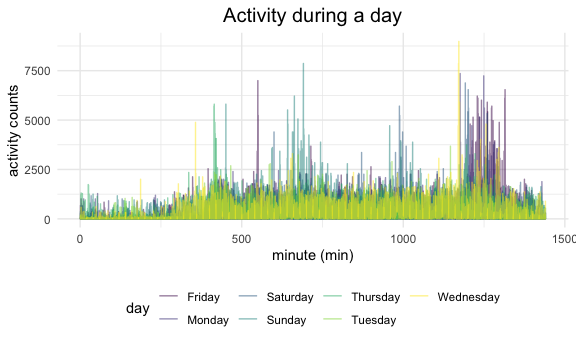
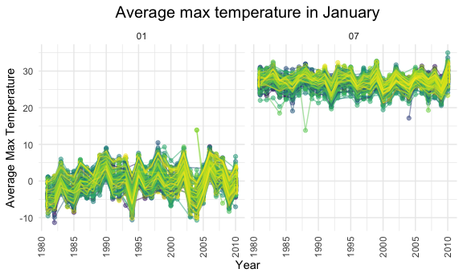
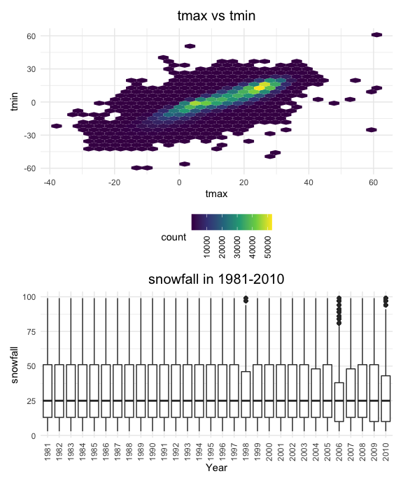

Homework 3
================
Phoebe Mo
2020-10-08

### Problem 1

``` r
data("instacart")
```

This dataset contains 1384617 rows and 15 columns. Observations are the
level of items in orders by user. There are user/order variables – user
ID, order ID, order date and order hour. There are also item variable –
name, aisle, department, and some numeric codes.

How many aisles, and which are most items from?

``` r
instacart %>%
  count(aisle) %>%
  arrange(desc(n))
```

    ## # A tibble: 134 x 2
    ##    aisle                              n
    ##    <chr>                          <int>
    ##  1 fresh vegetables              150609
    ##  2 fresh fruits                  150473
    ##  3 packaged vegetables fruits     78493
    ##  4 yogurt                         55240
    ##  5 packaged cheese                41699
    ##  6 water seltzer sparkling water  36617
    ##  7 milk                           32644
    ##  8 chips pretzels                 31269
    ##  9 soy lactosefree                26240
    ## 10 bread                          23635
    ## # … with 124 more rows

Let’s make a plot

``` r
instacart %>%
  count(aisle) %>%
  filter(n > 10000) %>%
  mutate(
    aisle = factor(aisle),
    aisle = fct_reorder(aisle, n)
  ) %>%
  ggplot(aes(x = aisle, y = n)) +
  geom_point() +
  theme(axis.text.x = element_text(angle = 90, vjust = 0.5, hjust = 1))
```


Let’s make a table

``` r
instacart %>%
  filter(aisle %in% c("baking ingredients", "dog food care", "packaged vegetables fruits")) %>%
  group_by(aisle) %>%
  count(product_name) %>%
  mutate(rank = min_rank(desc(n))) %>%
  filter(rank < 4) %>%
  arrange(aisle, rank) %>%
  knitr::kable()
```

| aisle                      | product\_name                                 |    n | rank |
| :------------------------- | :-------------------------------------------- | ---: | ---: |
| baking ingredients         | Light Brown Sugar                             |  499 |    1 |
| baking ingredients         | Pure Baking Soda                              |  387 |    2 |
| baking ingredients         | Cane Sugar                                    |  336 |    3 |
| dog food care              | Snack Sticks Chicken & Rice Recipe Dog Treats |   30 |    1 |
| dog food care              | Organix Chicken & Brown Rice Recipe           |   28 |    2 |
| dog food care              | Small Dog Biscuits                            |   26 |    3 |
| packaged vegetables fruits | Organic Baby Spinach                          | 9784 |    1 |
| packaged vegetables fruits | Organic Raspberries                           | 5546 |    2 |
| packaged vegetables fruits | Organic Blueberries                           | 4966 |    3 |

Apple vs ice cream..

``` r
instacart %>%
  filter(product_name %in% c("Pink Lady Apples", "Coffee Ice Cream")) %>%
  group_by(product_name, order_dow) %>%
  summarize(mean_hour = mean(order_hour_of_day)) %>%
  pivot_wider(
    names_from = order_dow,
    values_from = mean_hour
  )
```

    ## `summarise()` regrouping output by 'product_name' (override with `.groups` argument)

    ## # A tibble: 2 x 8
    ## # Groups:   product_name [2]
    ##   product_name       `0`   `1`   `2`   `3`   `4`   `5`   `6`
    ##   <chr>            <dbl> <dbl> <dbl> <dbl> <dbl> <dbl> <dbl>
    ## 1 Coffee Ice Cream  13.8  14.3  15.4  15.3  15.2  12.3  13.8
    ## 2 Pink Lady Apples  13.4  11.4  11.7  14.2  11.6  12.8  11.9

### Problem 2

Load, tidy, and otherwise wrangle the data

``` r
accel_df =
  read.csv("./data/accel_data.csv") %>%
  janitor::clean_names() %>%
  pivot_longer(
    activity_1:activity_1440,
    names_prefix = "activity_",
    names_to = "min_of_day",
    values_to = "activity_count"
  ) %>%
  mutate(
    dow = ifelse(day == "Saturday", "weekend",
          ifelse(day == "Sunday", "weekend", "weekday")),
    min_of_day = as.numeric(min_of_day)
  )
```

This resulting dataset has totally 50400 observations, each is about the
activity count in each minute of a day in a specific week. There are
variables: week, day\_id, day, dow(day of week), minute of the day, and
the activity counts. There are totally five weeks and 35 days in this
dataset, and the mean activity count in these 35 days is 267.0440592

Now create a table showing total activity over the day

``` r
accel_df %>%
  group_by(week, day) %>%
  summarize(
    activity_daily = sum(activity_count)
  ) %>%
  pivot_wider(
    names_from = "day",
    values_from = "activity_daily"
  ) %>%
  select("Monday", "Tuesday", "Wednesday", "Thursday", "Friday", "Saturday", "Sunday") %>%
  knitr::kable()
```

    ## `summarise()` regrouping output by 'week' (override with `.groups` argument)

    ## Adding missing grouping variables: `week`

| week |    Monday |  Tuesday | Wednesday | Thursday |   Friday | Saturday | Sunday |
| ---: | --------: | -------: | --------: | -------: | -------: | -------: | -----: |
|    1 |  78828.07 | 307094.2 |    340115 | 355923.6 | 480542.6 |   376254 | 631105 |
|    2 | 295431.00 | 423245.0 |    440962 | 474048.0 | 568839.0 |   607175 | 422018 |
|    3 | 685910.00 | 381507.0 |    468869 | 371230.0 | 467420.0 |   382928 | 467052 |
|    4 | 409450.00 | 319568.0 |    434460 | 340291.0 | 154049.0 |     1440 | 260617 |
|    5 | 389080.00 | 367824.0 |    445366 | 549658.0 | 620860.0 |     1440 | 138421 |

Observing the table, it is significant that in week 1, there are less
activity counts, especially in weekdays and Saturday. Also, the activity
counts during Tuesday and Wednesday are relatively stable. The activity
counts on Sunday is mostly decreasing during these 5 weeks.

Now, make a plot showing 24-hour activity time courses for each day

``` r
accel_df %>%
  group_by(day) %>%
  ggplot(aes(x = min_of_day, y = activity_count, color = day)) +
  geom_line(alpha = 0.5) +
  theme(legend.position = "bottom", plot.title = element_text(size = 15, hjust = 0.5)) +
  labs(
    title = "Activity during a day",
    x = "minute (min)",
    y = "activity counts"
  )
```



Observing the plot, we can find that during a day, the activity count
starts to increase from approximately 270 min of the beginning of every
day. On Friday, the patient has significant higher activity at around
8pm and on Sunday, there is much more activity at around noon. For other
days, their activity count is relatively stable during a day after the
early morning.

### Problem 3

``` r
library(p8105.datasets)
data("ny_noaa")
```

This ny\_noaa dataset contains 2595176 rows and 7 columns. Observations
are the weather situation of a specific station in each day from the
year 1981 to the year 2010. There are weather related variables –
precipitation, snowfall, snow depth, tmax and tmin. There are also item
variables – station ID, date of observation.

In this dataset, there are many missing values within. For example,
there are 1134358 missing values in tmax, which is near to 44% of the
observations. Since there are a large number of missing values in some
variables, they may cause a reduce in statistical power and may cause
some bias when we are analyzing.

``` r
ny_noaa_df =
  ny_noaa %>%
  janitor::clean_names() %>%
  separate(
    date,
    into = c("year", "month", "day"),
    sep = "-",
  ) %>%
  mutate(
    tmax = as.numeric(tmax),
    tmin = as.numeric(tmin),
  ) %>%
  mutate(
    tmax = tmax / 10,
    tmin = tmin / 10
  )

ny_noaa %>%
  count(snow) %>%
  arrange(desc(n))
```

    ## # A tibble: 282 x 2
    ##     snow       n
    ##    <int>   <int>
    ##  1     0 2008508
    ##  2    NA  381221
    ##  3    25   31022
    ##  4    13   23095
    ##  5    51   18274
    ##  6    76   10173
    ##  7     8    9962
    ##  8     5    9748
    ##  9    38    9197
    ## 10     3    8790
    ## # … with 272 more rows

For snowfall, the most common observed value is 0, where there are
2008508 records showing 0. Then, there are 381221 missing values. The
most common value is 0 is because during a year, NY will have snow in
winter, and there is no snow in other three seasons.

Now, make a two-panel plot showing the average max temperature in
January and July in each station across years.

``` r
plot_Jan =
  ny_noaa_df %>%
  filter(month == "01") %>%
  filter(!is.na(tmax)) %>%
  mutate(
    year = as.numeric(year)
  ) %>%
  group_by(month, year, id) %>%
  summarize(mean_max = mean(tmax, na.rm = T)) %>%
  ggplot(aes(x = year, y = mean_max, color = id)) +
  geom_line() +
  theme(axis.text.x = element_text(angle = 90, vjust = 0.5, hjust = 1), legend.position = "none", plot.title = element_text(size = 15, hjust = 0.5)) +
  scale_x_continuous(breaks = seq(from = 1980, to = 2010, by = 1)) +
  labs(
    title = "Average max temperature in January",
    x = "Year",
    y = "Average Max Temperature"
  )
```

    ## `summarise()` regrouping output by 'month', 'year' (override with `.groups` argument)

``` r
plot_July =
  ny_noaa_df %>%
  filter(month == "07") %>%
  filter(!is.na(tmax)) %>%
  mutate(
    year = as.numeric(year)
  ) %>%
  group_by(month, year, id) %>%
  summarize(mean_max = mean(tmax, na.rm = T)) %>%
  ggplot(aes(x = year, y = mean_max, color = id)) +
  geom_line() +
  theme(axis.text.x = element_text(angle = 90, vjust = 0.5, hjust = 1), legend.position = "none", plot.title = element_text(size = 15, hjust = 0.5)) +
  scale_x_continuous(breaks = seq(from = 1980, to = 2010, by = 1)) +
  labs(
    title = "Average max temperature in July",
    x = "Year",
    y = "Avg Max Temperature"
  )
```

    ## `summarise()` regrouping output by 'month', 'year' (override with `.groups` argument)

``` r
plot_Jan / plot_July
```



Observing the two plots together, we can know that in January, current
year’s average of max is increasing. That is, the average max
temperature is increasing in the winter case. The structure is like a
wave-shape, which means the average max temperature fluctuates in these
30 years. There is an outlier in January of 1982, in which the average
max temperture is lower than -12.5.

For July, the average of max temperature is also increasing, and this is
apparent in 2010. We can also observe that this plot has a relatively
stable wave-like structure than the previous one. In approximately
4-year interval, the average max temperature in July will decrease
relatively sharp in a time period, and there is an outlier in July of
1988, which is lower than 15.

Now make a two-panel plot showing tmax vs tmin for the full dataset

``` r
temp_compare_plot =
  ny_noaa_df %>%
  ggplot(aes(x = tmax, y = tmin)) +
  geom_hex(na.rm = T) +
  theme(legend.text = element_text(angle = 90, vjust = 0.5, hjust = 0.5),      plot.title = element_text(size = 15, hjust = 0.5)) +
  labs(title = "tmax vs tmin")

snowfall_plot =
  ny_noaa_df %>%
  filter(!is.na(snow), snow > 0, snow < 100) %>%
  ggplot(aes(x = year, y = snow)) +
  geom_boxplot() +
  theme(axis.text.x = element_text(angle = 90, vjust = 0.5, hjust = 1), plot.title = element_text(size = 15, hjust = 0.5)) +
  labs(title = "snowfall in 1981-2010", x = "Year", y = "snowfall")

temp_compare_plot / snowfall_plot
```



In the plot comparing tmax and tmin, most data is gathering around hexs
where the tmax is around 10-20 and tmin is around 15. In the annual
snowfall plot, we notice that the median and interquatile range is
approximately same for each year except for 1998, 2004, 2006, 2007, and
2010. In the plot, there are also some outliers in year 1998, 2006, and
2010. It is interesting to notice that after 2004, the snowfall level
fluctuated more between years and began to have lower minimum snowfall
compared to years before 2004.
